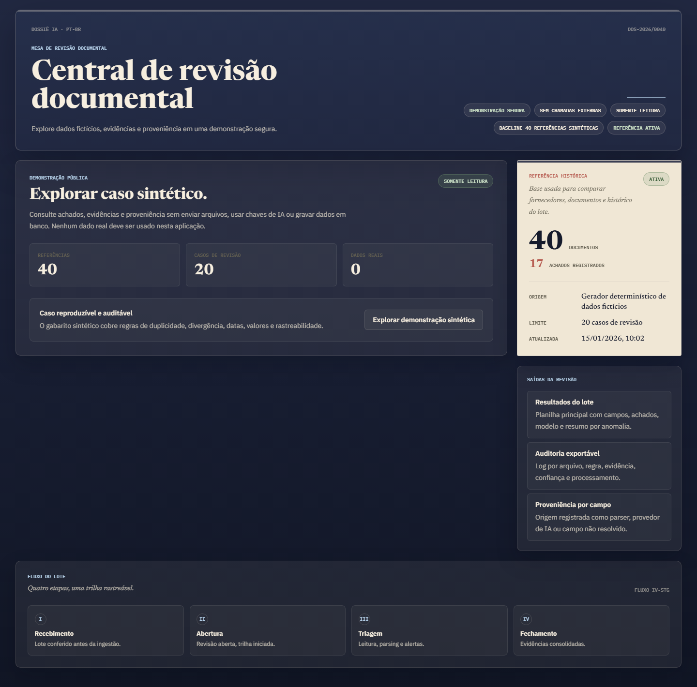
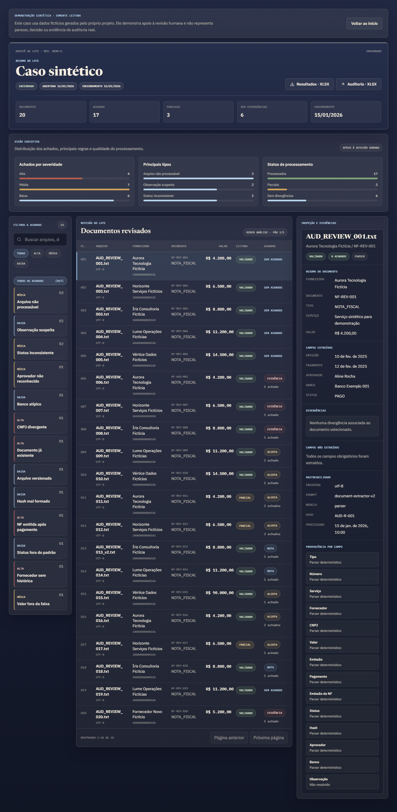
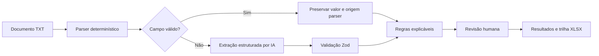

# Auditor de Documentos com IA

Aplicação de apoio à revisão documental com parser determinístico, fallback por IA, regras explicáveis e trilha de auditoria. O projeto foi iniciado como estudo técnico pessoal e reconstruído como portfólio de **IA aplicada a GRC**, usando apenas dados sintéticos próprios.

> A ferramenta organiza indícios para revisão humana. Ela não emite parecer, não comprova fraude e não substitui auditoria profissional.

## Demonstração

A versão pública opera em modo somente leitura: não recebe arquivos, não usa banco de dados e não chama provedores de IA. O visitante explora um caso sintético reproduzível com 40 documentos históricos e 20 casos de revisão.

- Aplicação: implantação da versão sanitizada pendente
- Repositório: <https://github.com/lucasppinheiro/auditor-documentos-ia>
- Caso local: `http://localhost:3000/demo`





## O que o projeto demonstra

- Extração híbrida: o parser é a fonte primária e a IA preenche somente campos ausentes ou inválidos.
- Proveniência por campo: `parser`, `gemini`, `openai` ou `unresolved`.
- Treze regras determinísticas com severidade, confiança, mensagem e evidência estruturada.
- Exportação separada de resultados e eventos de auditoria em XLSX.
- Modo público seguro por padrão e processamento interativo apenas quando configurado localmente.
- Avaliação reproduzível contra gabarito sintético, sem chamadas externas no CI.

## Arquitetura



Stack principal: Next.js 16, React 19, TypeScript, PostgreSQL no modo interativo, Gemini ou OpenAI como fallback, ExcelJS para exports, Vitest e Playwright.

## Modos de execução

| `APP_MODE` | Uso | Banco e IA | Escrita HTTP |
|---|---|---|---|
| `demo` | Portfólio público, padrão seguro | Não são necessários | Bloqueada com `READ_ONLY_DEMO` |
| `interactive` | Desenvolvimento local controlado | Configuração obrigatória | Habilitada |

No modo `demo`, `/demo` e os exports sintéticos funcionam sem segredos. Sessões persistidas, métricas internas e endpoints mutáveis não ficam expostos.

## Como executar

Pré-requisito: Node.js 22.

```bash
npm ci
npm run dev
```

A aplicação inicia em modo demonstrativo. Acesse <http://localhost:3000>.

Para testar o fluxo interativo local:

```bash
cp .env.example .env.local
# configure APP_MODE=interactive, DATABASE_URL e um provedor de IA
npm run dev
```

As variáveis disponíveis estão em `.env.example`. Chaves de API são usadas somente no servidor e nunca devem ser versionadas.

## Dados sintéticos e avaliação

O gerador em `src/lib/demo/synthetic-dataset.ts` cria:

- 40 documentos históricos distribuídos entre cinco fornecedores fictícios;
- 20 casos de revisão;
- gabarito com os 13 tipos de regra efetivamente implementados;
- nomes, identificadores, bancos, valores e hashes sem relação com clientes ou empresas reais.

Detalhes de proveniência estão em [DATASET.md](DATASET.md). Para executar a avaliação:

```bash
npm run eval
```

O comando falha quando qualquer resultado diverge do gabarito ou quando menos de 13 regras são cobertas.

Uma avaliação opcional com o provedor configurado pode ser executada somente com os casos sintéticos:

```bash
npm run eval:ai
```

Esse comando faz chamadas externas e, por isso, não integra o CI.

## Segurança e governança

- O modo seguro é aplicado quando `APP_MODE` está ausente ou inválido.
- Escritas públicas retornam HTTP 403 com o código `READ_ONLY_DEMO`.
- Sessões interativas e métricas retornam 404 no modo demonstrativo.
- O health check expõe apenas estado e timestamp.
- A resposta da IA passa por validação Zod antes do merge.
- Campos confiáveis do parser não podem ser sobrescritos pela IA.
- Dados reais, evidências de cliente, credenciais e informações sensíveis estão fora do escopo.

O modelo de governança e as limitações estão em [docs/model-governance.md](docs/model-governance.md).

## Qualidade

```bash
npm run lint
npm test
npm run eval
npm run build
npm run test:e2e
npm audit --omit=dev --audit-level=high
```

O CI executa os mesmos controles com Node.js 22. A cobertura mínima do núcleo é 80% para linhas, funções e statements, e 75% para branches.

O audit de produção deve permanecer sem vulnerabilidades altas ou críticas. Dependências transitivas moderadas são registradas e acompanhadas até existir uma atualização compatível, sem aplicar correções forçadas que introduzam regressões.

## Limitações conhecidas

- O parser cobre o formato textual chave-valor usado pelo conjunto sintético.
- Regras estatísticas dependem de uma referência histórica adequada.
- Confiança de uma regra indica força do critério determinístico, não probabilidade de fraude.
- Integrações reais com provedores podem variar por modelo e devem ser avaliadas antes de uso profissional.
- O modo interativo é destinado a ambiente local controlado; autenticação multiusuário não faz parte desta versão.
